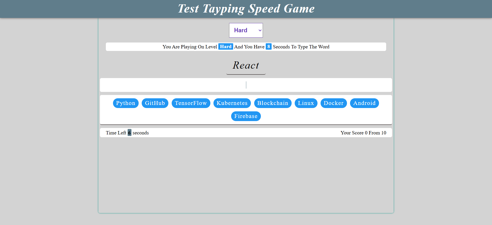
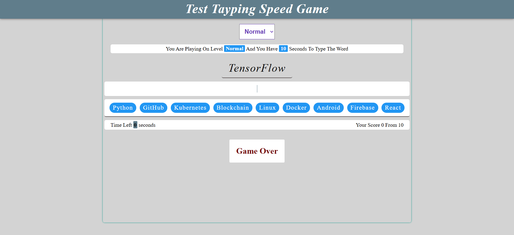
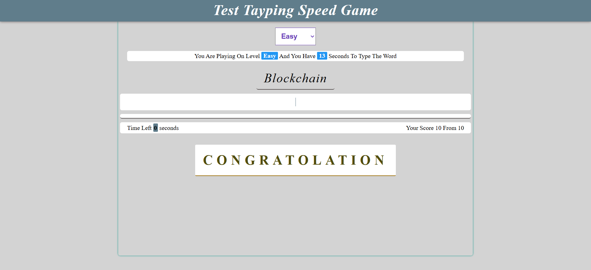
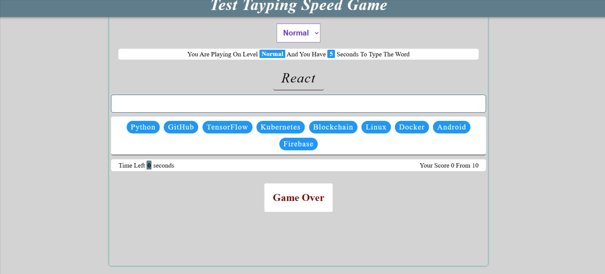

# 🎮 Typing Speed Test Game

An interactive typing speed and accuracy test game built with pure Vanilla JavaScript. Players challenge themselves to type technical words within a time limit based on the selected difficulty level.

> **Note:** This README file was organized and formatted with the assistance of AI to ensure clarity and comprehensive documentation.

---

## 📋 Overview

**Typing Speed Test Game** is an interactive typing speed and accuracy test game. Players challenge themselves to type technical words within a time limit based on the selected difficulty level. The game features three difficulty levels, a timer system, score tracking, and a beautiful modern UI.

---
## 📸 Project Screenshots

### Screenshot 1: Main Menu


### Screenshot 2: Gameplay - Easy Level


### Screenshot 3: Gameplay - Hard Level


### Screenshot 4: Game Completion



## ✨ Features

- 🎯 **Three Difficulty Levels**
  - Easy: 13 seconds per word
  - Normal: 10 seconds per word
  - Hard: 8 seconds per word

- ⏱️ **Timer System**
  - Countdown timer for each word
  - Clear display of remaining time

- 📊 **Scoring System**
  - Track achieved points
  - Display total words count

- 🎨 **Beautiful UI**
  - Modern and attractive design
  - Consistent color scheme
  - Smooth animations

- 📱 **Responsive Design**
  - Works on all devices
  - Excellent user experience

- 🔒 **Paste Protection**
  - Prevents text pasting to ensure test accuracy

---

## 🛠️ Technologies Used

- **HTML5** - Page structure
- **CSS3** - Styling and layout
  - CSS Variables
  - Flexbox
  - Animations & Transitions
- **Vanilla JavaScript** - Functionality and interactivity
- **Normalize.css** - Cross-browser style normalization
- **Open Sans Font** - Custom fonts
- **Font Awesome** - Icons

---

## 📁 Project Structure

```
Tayping Time App Vanilla Js/
│
├── index.html              # Main page
├── README.MD               # Documentation file
│
├── css/
│   ├── master.css         # Main stylesheet
│   ├── normalize.css      # Style normalization
│   └── all.min.css        # Additional CSS file
│
├── js/
│   └── master.js          # Main JavaScript file
│
├── images/
│   └── Typing-Speed-Game-Screenshot.png  # Screenshot
│
├── Open_Sans/             # Open Sans fonts
│   └── static/            # Static font files
│
└── webfonts/              # Font Awesome fonts
    └── ...
```

---

## 🚀 How to Use

### Installation

1. **Clone the repository**
   ```bash
   git clone [repository-url]
   ```

2. **Open the project**
   - Open the `index.html` file in a web browser
   - Or use a local server like Live Server

### How to Play

1. **Select Difficulty Level**
   - Choose from the dropdown: Easy, Normal, or Hard

2. **Start Playing**
   - Click the "Start Playing" button
   - A technical word will appear that you need to type

3. **Type the Word**
   - Type the displayed word in the input field
   - Monitor the remaining time

4. **Score Points**
   - If you type the word correctly before time runs out, you get a point
   - If time runs out before typing correctly, the game ends

5. **Complete All Words**
   - Complete all ten words to win the game

---

## 🎯 Game Rules

- ⏰ Each word has a specific time limit based on difficulty level
- ✅ Words must be typed correctly (case-insensitive)
- 🚫 Text pasting is not allowed (Paste is disabled)
- 📝 Words appear randomly
- 🏆 Win by completing all words successfully

---


---

## 🎨 Customization

### Adding New Words

You can add new words in the `js/master.js` file:

```javascript
let words = [
  "Python",
  "GitHub",
  // Add your words here
  "YourWord",
];
```

### Modifying Time Limits

You can modify level times in the `js/master.js` file:

```javascript
let levels = {
  Easy: 13,    // seconds
  Normal: 10,  // seconds
  Hard: 8,     // seconds
};
```

### Changing Colors

You can modify colors in the `css/master.css` file:

```css
:root {
  --mainColor--: #2196f3; /* Main color */
}
```

---

## 🌐 Browser Requirements

- ✅ Chrome (Latest version)
- ✅ Firefox (Latest version)
- ✅ Safari (Latest version)
- ✅ Edge (Latest version)

---


## 🔧 Main Files

### `index.html`
- Main page structure
- User interface elements

### `js/master.js`
- Game logic
- Time and score management
- Random word generation

### `css/master.css`
- All design styles
- Animations
- Responsive layout

---

## 🚀 Deployment


- **Platform:** Vercel
- **Status:** Under development
- **Created By:** Mostafa Abdellraheem

### Contact & Links

- **GitHub:** [MostafaAbelraheem2020](https://github.com/MostafaAbelraheem2020)
- **LinkedIn:** [Mostafa Mohamed](https://www.linkedin.com/in/mostafa-mohamed-63b87627a/)
- **WhatsApp:** [Contact](https://wa.me/01010317417)

---


## 🔮 Future Improvements

- [ ] Add additional difficulty levels
- [ ] Score saving system (Leaderboard)
- [ ] Detailed statistics (WPM, Accuracy)
- [ ] Multiplayer mode
- [ ] Different color themes
- [ ] Multi-language support
- [ ] Add game sounds

---


## 👨‍💻 Developer

Developed with pure Vanilla JavaScript by **Mostafa Abdellraheem**.

---


## ⭐ Thanks for Playing!

Enjoy improving your typing speed! 🚀

---

**Last Updated:** 2024
